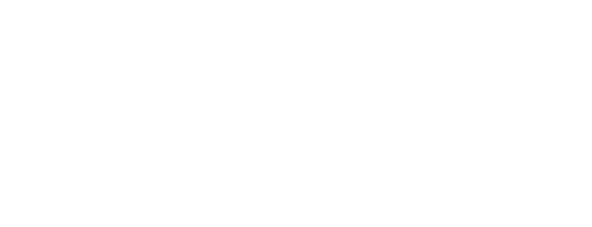
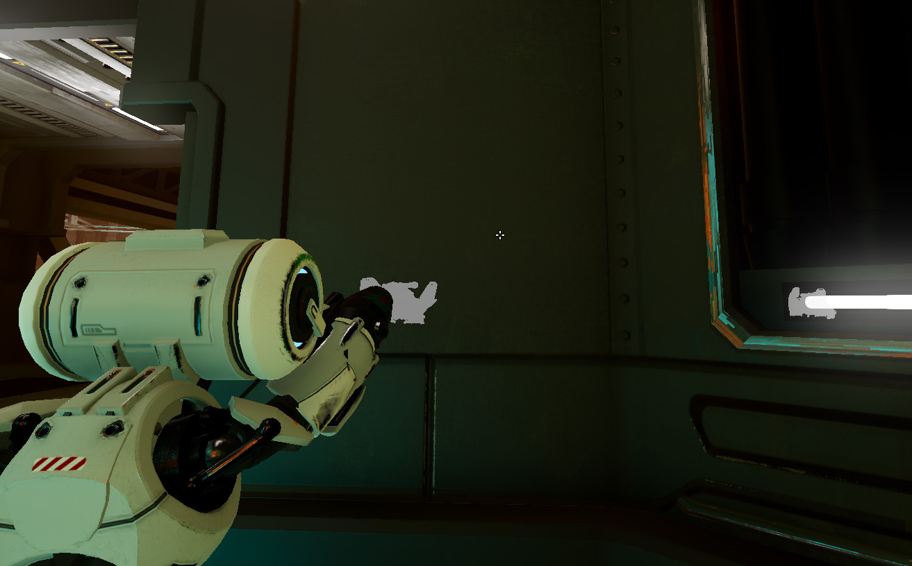

# Depth Buffer Plugin
A plugin for Godot 4.3+ to make viewport depth buffers usable by other viewports or shaders. This enables effects that require the depth buffer from a separate viewport, or can be used in some cases where a stencil buffer would normally be used (a silhouette effect for example).

## How it works
The plugin works by adding custom type of `SubViewport` called `DepthBufferViewport`. Since the depth buffer of a `SubViewport` can't be accessed by another `Viewport` currently in Godot, the depth buffer of `DepthBufferViewport`s are encoded to a color image which can be accessed by other `Viewport`s through the `ViewportTexture`. This encoded texture can then be decoded by a shader or `CompositorEffect` to get the original depth buffer back. The encoding works by converting the 32bit float depth buffer to 4x 8bit unsigned integers by direct bit copying and assinging those uints to the color channels of the viewport output.



## How to use it

The plugin adds an autoload node called `DepthBufferManager` which can be used to add `DepthBufferViewport`s from code. To create one, call

```
var dbv = DepthBufferManager.create_depth_buffer_viewport(cull_mask, viewport_target)
```

which will create one with the specified camera cull mask and target viewport. For ease of use, `DepthBufferViewport`s have a `target_viewport` property which will make the camera of the `DepthBufferViewport` track the camera of the `target_viewport`. The `DepthBufferViewport` will not be ready for use immediately since the engine needs to render a frame before the viewport texture is valid. After creating the viewport, you can use

```
if not dbv.is_viewport_ready():
    await dbv.viewport_ready
```

to wait until the `ViewportTexture` is ready, for example to pass it to a shader. To decode the encoded depth buffer, you can add `#include "addons/depth_buffer/depth_decode.gdshaderinc"` to your [fullscreen shader](https://docs.godotengine.org/en/stable/tutorials/shaders/advanced_postprocessing.html#) and call `decode_depth()`, or use the included silhouette `CompositorEffect` as an example to make your own `CompositorEffect`.

The plugin comes with a premade silhouette effect that can be used with the new `CompositorEffect` system in Godot 4.3. To use it, add a `Compositor` to either the scene's `Environment` or the `Camera3D` and add a `PostProcessSilhouette` effect (the effect will handle the creation of the `DepthBufferViewport`s). The `silhouette_mask` is the render layer which will show up over other objects in the scene as the silhouette, and the `obstruction_layer` is the render layer which the silhouette will not show in front of. The effect callback type can be changed to either `Pre Transparent` or `Post Transparent` depending on if you want the silhouettes to show up behind or in front of transparent objects/materials.

Any mesh that you want to be shown as a silhouette needs to have its `VisualInstance3D.layer` set to include the `silhouette_mask`, and any mesh that you don't want the silhouette to be shown over should have its layer set to include `obstruction_mask`. You may need to set the node to allow children to be edited (right click > editable children) if you have imported a mesh into the editor and can't change its render layer. In the example image below, the enemies are on render layers 1 & 2 and the player is on render layers 1 & 3, with `silhouette_mask` set to layer 2 and `obstruction_mask` set to layer 3:



## Limitations
- This plugin currently only works with the Forward+ renderer. It should also work with the Mobile renderer but [this](https://github.com/godotengine/godot/issues/96737) bug prevents the viewport's color texture from being written to in a compute shader.
- This requires the new `CompositorEffect`s added in Godot 4.3 since the alpha channel of a viewport's texture can't be overwritten in a regular Godot shader.
- While I've tried my best to make this plugin performant, it still requires rendering extra viewports which can be expensive. If only a few objects are being re-rendered (as is the case with the silhouette) the impact is not too much, but still more than a native stencil buffer approach. When/if stencil buffer access is allowed in Godot, this plugin would probably be unneccessary.
- Antialiasing: The silhouette effect does not work well with AMD FSR 2.2 or TAA and does not work at all with MSAA, but does work with FXAA. (Could maybe be fixed, I just don't know how TAA or MSAA work lol)
